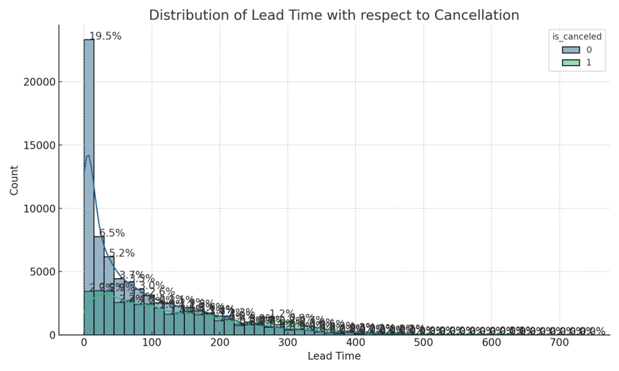

# Predictive Analysis and Key Determinants of Hotel Booking Cancellations

*Anuj Patil a,1

*a Department of Applied Data Science, Clarkson University, NY, USA*

## Abstract

This research aimed to create a robust predictive model for hotel booking cancellations using the Cat Boost classifier, a powerful gradient boosting machine learning algorithm known for its effectiveness with both categorical and numerical data. The objective was to provide valuable insights to hotel management for anticipating cancellations, enhancing customer service, and optimizing revenue.

The project commenced with an in-depth exploratory data analysis, yielding crucial insights into data patterns and relationships. A rigorous feature selection process followed, identifying the most influential predictors of cancellations. Through this, variables such as required car parking spaces, country of origin, type of deposit, lead time, and market segment emerged as significant determinants.

The final predictive model achieved an impressive accuracy of approximately 88.30% on the test set, demonstrating its robustness and potential utility in the hospitality industry. Furthermore, the model's performance was validated using ROC Curve Analysis, achieving an AUC of 0.95.

## Keywords

Hotel Booking Analysis, Cancellation Forecasting, Cat Boost Classifier, Predictive Modelling, Machine Learning Applications, Feature Importance Analysis, Hyperparameter Optimization, Exploratory Data Analysis, Model Evaluation Metrics, Hospitality Industry Insights

## Introduction

The hotel industry is a vital part of the hospitality sector, playing a significant role in the global economy. One of the critical challenges faced by this industry is booking cancellations, which significantly impact revenue management and operational planning. Understanding and predicting booking cancellations can offer valuable insights for hotel management, helping them implement effective strategies to minimize the impact of cancellations and optimize their revenue.

Machine learning offers promising solutions to this problem by leveraging historical booking data to predict future cancellations. With the rise of big data, hotels now have access to vast amounts of data, including detailed information about each booking. By applying machine learning algorithms to this data, it is possible to build predictive models that can accurately forecast whether a booking is likely to be cancelled.

This project aims to apply a machine learning approach to predict hotel booking cancellations. Specifically, we use a gradient boosting model, known as Cat Boost, which is particularly effective when dealing with a mix of categorical and numerical features. The project involves various stages including data preprocessing, exploratory data analysis, feature selection, feature engineering, model building, and hyperparameter tuning. The final output is a model that can predict whether a hotel booking will be cancelled based on information available at the time of booking. The insights derived from this project can help hotel management make informed decisions and formulate effective strategies to minimize the impact of cancellations.

## Methods

1. Data Collection

The dataset used in this project contains information about hotel bookings. This includes details like the time of booking, duration of stay, number of guests, and many other features. The dataset also includes a target variable indicating whether each booking was cancelled.

- Number of records: 119,390
- Number of features: 32
- Number of numerical columns: 14
- Number of categorical columns: 16
- Text Column: 1
- Data Time Column: 1
- Average cancellation rate (%): 37.04

2. Data Preprocessing

The dataset used for this project contained a variety of information related to hotel bookings. These features included both categorical and numerical types, and some had missing values. The preprocessing steps included:

- Handling Missing Values: Missing values were imputed in the 'children', 'country', and 'agent' columns. For 'children' and 'country', the mode (most frequent value) was used. For the 'agent' column, a placeholder value of -1 was used, indicating that no agent was involved in the booking. The 'company' column, which had a high number of missing values, was dropped from the dataset.
- Data Type Conversions: The 'children' and 'agent' columns were converted to integer data types for consistency.
- Date Conversion and Feature Creation: The arrival date, initially split into three columns (year, month, and day), was consolidated into a single 'arrival_date' column. A 'day_of_week' column was added, indicating the day of the week on which the guests were scheduled to arrive.
- Total Guests: A 'total_guests' feature was created as the sum of the 'adults', 'children', and 'babies' columns, representing the total number of guests for each booking.

Characteristic | Value
--- | ---
% of null cells | 3.39%
Duplicate rows | 31,994
% of duplicate rows | 26.80%
Column with most missing values | Company
% of missing values in Company column | 94.31%

3. Exploratory Data Analysis

The exploratory data analysis aimed to understand the distribution of data and the relationships between different features. This process involved:
- Visualizing Distributions: The distributions of numerical and categorical variables were visualized using histograms, bar plots, and pie charts.

- Analyzing Correlations: The correlations between features were analyzed using a correlation matrix and represented visually using a heatmap.

# Feature Selection

The feature selection process aimed to identify the most relevant features for predicting cancellations. This process involved two techniques:

## Correlation Analysis (Numerical Features)

For numerical features, the Pearson correlation coefficient with the target variable ("is_canceled") was calculated. Features with a correlation coefficient greater than 0.05 or less than -0.05 were selected as relevant features.

| Column                           | Correlation | P-value |
|----------------------------------|-------------|---------|
| is_canceled                      | 1.000       | 0.000   |
| lead_time                        | 0.293       | 0.000   |
| arrival_date_year                | 0.017       | 0.000   |
| arrival_date_week_number         | 0.008       | 0.005   |
| arrival_date_day_of_month        | -0.006      | 0.034   |
| stays_in_weekend_nights          | -0.002      | 0.536   |
| stays_in_week_nights             | 0.025       | 0.000   |
| adults                           | 0.060       | 0.000   |
| children                         | 0.005       | 0.082   |
| babies                           | -0.032      | 0.000   |
| is_repeated_guest                | -0.085      | 0.000   |
| previous_cancellations           | 0.110       | 0.000   |
| previous_bookings_not_canceled   | -0.057      | 0.000   |
| booking_changes                  | -0.144      | 0.000   |
| agent                            | -0.046      | 0.000   |
| days_in_waiting_list             | 0.054       | 0.000   |
| adr                              | 0.048       | 0.000   |
| required_car_parking_spaces      | -0.195      | 0.000   |
| total_of_special_requests        | -0.235      | 0.000   |

## Chi-square Tests (Categorical Features)

For categorical features, Chi-square tests of independence were performed to determine which features were significantly associated with cancellations. All categorical features were found to be significantly associated with the target variable and were thus selected as relevant features.

| Feature                    | Chi-Square    | Chi-Square p-value |
|----------------------------|---------------|--------------------|
| hotel                      | 2224.92       | 0.0                |
| arrival_date_month         | 588.69        | 0.0                |
| meal                       | 304.24        | 0.0                |
| country                    | 15434.68      | 0.0                |
| market_segment             | 8497.22       | 0.0                |
| distribution_channel       | 3745.79       | 0.0                |
| reserved_room_type         | 647.84        | 0.0                |
| assigned_room_type         | 4918.69       | 0.0                |
| deposit_type               | 27677.33      | 0.0                |
| customer_type              | 2222.50       | 0.0                |
| reservation_status         | 119390.00     | 0.0                |
| reservation_status_date    | 2423.06       | 0.0                |

The combination of both these feature selection techniques resulted in the final set of selected features for building the predictive model. This comprehensive feature selection process ensured that the most informative features, both numerical and categorical, were used to train the model.

**Selected Features**

1. lead_time
2. previous_cancellations
3. adults
4. days_in_waiting_list
5. previous_bookings_not_canceled
6. is_repeated_guest
7. booking_changes
8. required_car_parking_spaces
9. total_of_special_requests
10. hotel
11. country
12. market_segment
13. distribution_channel
14. assigned_room_type
15. deposit_type
16. customer_type
17. reservation_status_date
18. reserved_room_type
19. meal

Model Building and Evaluation

The predictive model was built using the Cat Boost classifier, a gradient boosting model known for its robust performance with both categorical and numerical data. This model was selected due to its ability to handle a mix of categorical and numerical features without the need for explicit one-hot encoding, making it particularly suited for this dataset.

- Model Training: The model was trained on 80% of the dataset. The training process involves learning the relationship between the features (hotel booking details) and the target variable (whether the booking was cancelled) in the training data.
- Model Evaluation: The model's performance was evaluated on the remaining 20% of the dataset, which was not used during the training process. This test set serves as new, unseen data for the model, providing a measure of how well the model generalizes to new data. The primary metric used to evaluate the model was accuracy, which measures the proportion of correct predictions. The initial model achieved an accuracy of approximately 88.30% on the test set.

Hyperparameter Tuning

The performance of the Cat Boost model can be influenced by several hyperparameters, which control aspects of the training process. To find the best set of hyperparameters, a hyperparameter tuning process was conducted.

- Randomized Search: A randomized search was performed on the depth of the trees, the learning rate, and the number of iterations. The depth of the trees controls the complexity of the model, the learning rate controls the step size in the iterative process of gradient boosting, and the number of iterations controls how long the model trains for. The randomized search involves randomly selecting combinations of hyperparameters, training a model with each combination, and selecting the combination that performs best on the validation data.

Feature Importance Analysis

After training the model, the importance of each feature was calculated. This provides insights into which features have the greatest impact on the prediction of cancellations. The feature importance is calculated based on the improvement in accuracy that each feature provides when it is included in the trees of the Cat Boost model.

ROC Curve Analysis

The Receiver Operating Characteristic (ROC) curve is a fundamental tool for diagnostic test evaluation. In a ROC curve, the true positive rate (Sensitivity) is plotted against the false positive rate (100-Specificity) for different cut-off points. Each point on the ROC curve represents a sensitivity/specificity pair corresponding to a particular decision threshold.

The Area Under the ROC curve (AUC) is a measure of how well a parameter can distinguish between two diagnostic groups (diseased/normal).

In the context of this project, the ROC curve is a graphical plot that illustrates the performance of the cancellation prediction system as its discrimination threshold is varied. The AUC of 0.95 means that there is a 95% chance that the model will be able to distinguish between the positive class and the negative class. This is considered as very good performance.

## Results

The predictive model built for this project achieved promising results. The Cat Boost classifier was trained on a dataset of hotel bookings, with a variety of features including both categorical and numerical types. After preprocessing the data and conducting feature selection and feature engineering, the model was trained with the optimal hyperparameters found through a randomized search.

The initial model achieved an accuracy of approximately 88.30% on a test set, representing new, unseen data. After hyperparameter tuning, the model's performance improved, achieving an accuracy of approximately 89.12% on the test set. These results demonstrate the model's ability to generalize well to new data.

The most important features for predicting cancellations were found to be the number of required car parking spaces, the country of origin (Portugal), the type of deposit (non-refundable), the lead time, and the market segment (Online TA).

## Discussion

The results of this project provide valuable insights for the hotel industry. By understanding the key factors that influence cancellations, hotels can implement strategies to minimize the impact of cancellations and optimize their revenue. For instance, knowing that the number of required car parking spaces is a key determinant of cancellations, hotels could consider implementing policies related to car parking to reduce cancellations.

It is also interesting to note that bookings from Portugal and bookings made through online travel agents were found to be significant predictors of cancellations. This suggests that there may be specific characteristics or behaviors associated with these segments that make them more prone to cancellations. Further research could explore these relationships in more detail.

The model's performance suggests that it could be a useful tool for hotels to predict cancellations. However, it is important to note that the model is based on historical data and may not account for unforeseen events or changes in customer behavior. As such, it should be used in conjunction with other management strategies to optimize hotel operations and customer service.

## Future Work

Future research can focus on refining the model by exploring additional feature engineering techniques and considering the inclusion of external data sources. Additionally, investigating the model's practical application in real-world hotel management contexts can provide valuable insights into its effectiveness and limitations.

In conclusion, this study's findings offer valuable strategies to reduce cancellations and improve customer service in the hotel industry. By leveraging machine learning techniques and data-driven insights, hotels can take proactive measures to optimize their operations and enhance the overall guest experience.

